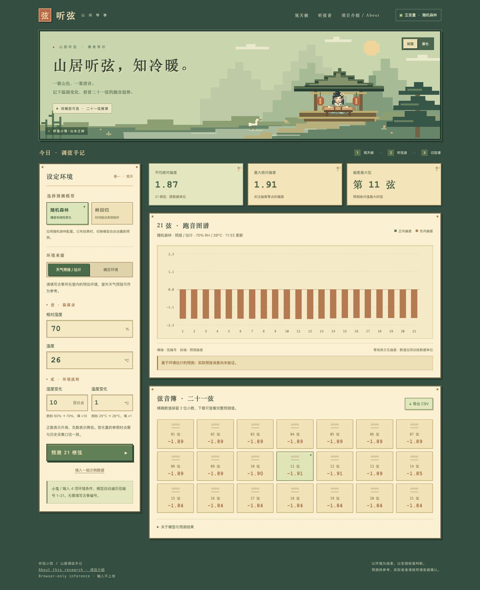

# 听弦小筑｜古筝 21 弦跑音预测

天气变了，古筝的 21 根弦会怎样跑音？这个项目用已有的调音记录做了个尝试：把温湿度与每根弦的偏差放在一起，比较几种预测模型，再做成一个可以自己输入条件的网页。

网页文件已经放在 [`docs/`](docs/) 中。[在线地址](https://xinyang-guo.github.io/guzheng-tuning-drift-model/)目前还没有启用；想在本机打开，可以看下面的“本地预览”。



## 网页怎么用

填入预计或测得的**湿度、湿度变化、温度、温度变化**，选择岭回归或随机森林，点击预测，就能看到 1～21 弦的结果和图表，也可以下载 CSV。网页会自动补上弦编号；古筝编号不作为模型输入。

湿度填百分比，湿度变化填**百分点**。例如湿度从 60% 到 70%，变化量填 `+10`。温度和温度变化都用 ℃。选择“预报/估计”或“确定值”只是标记输入来源，不会更换模型；网页也不会自动抓取天气预报。

## 哪个模型更适合现在的用途

起初比较了线性回归、岭回归、决策树和随机森林，也试过不同参数及去掉古筝编号的版本。那一轮按调音次数随机划分数据，随机森林的成绩最好。后来明确要预测**之后的调音**，就改为用较早日期训练、较晚日期检验。

清理后有 64 次调音，共 1,344 条弦记录。当前实验用 6 月 17 日至 8 月 19 日的数据选择模型，把 8 月 20 日至 25 日留到最后评估；原始日期没有年份，这里按同一年处理。

| 模型 | 较晚日期的 MAE ↓ | MSE ↓ | R² ↑ |
|---|---:|---:|---:|
| 岭回归 | **6.53** | **74.56** | **0.60** |
| 随机森林 | 10.04 | 179.52 | 0.03 |
| 只预测训练集均值 | 10.76 | 209.02 | −0.13 |

这轮先用较早数据中的滚动验证选中了岭回归，再看上表的留出结果。因此**目前更倾向于用岭回归预测后续调音**，网页仍保留随机森林供比较。旧实验和这轮实验的测试数据不同，分数不能直接比较。完整数值见 [时间验证结果](results/time_validation_metrics.csv) 和 [之前 18 组实验的汇总](results/aggregate_metrics.csv)。

这些成绩用的是记录里的**实测环境**。真正提前预测时，温湿度只能来自天气预报或估计，误差还没有检验；室外预报也未必等于古筝所在房间的环境。网页里的两个模型已用全部历史记录重新训练，上表评估的是重训前留出测试的版本，不能当作网页模型未来表现的保证。原数据没有明确说明偏差的物理单位和正负方向，因此网页不把结果解释成音分或具体调弦动作。

## 仓库里有什么

- [`docs/`](docs/)：可部署的网页，包含两种模型的浏览器预测文件。
- [`src/`](src/)：数据处理、训练和验证代码。
- [`results/`](results/)：时间验证、旧实验和参数搜索的汇总结果。
- [`web/`](web/)：之前依赖本地 Python 服务的网页版本。
- [`scripts/`](scripts/)：导出网页模型及检查结果的工具。

代码、网页和文档整理过程中用过 AI 工具。若把项目用于申请材料，请按实际参与情况说明自己的工作。

## 本地预览与上线

在仓库根目录运行：

```bash
python3 -m http.server 8000 --directory docs
```

再打开 <http://localhost:8000>。本地预览需要这个简单的文件服务，让浏览器加载模型文件；网页预测本身在浏览器里完成。GitHub 上线步骤见 [DEPLOY.md](DEPLOY.md)。

**公开前请留意：**仓库根目录已有 `古筝调音数据.xlsx`。直接公开这个仓库，会连同 Git 历史一起公开原始文件；只删除当前文件无法清除历史记录。
